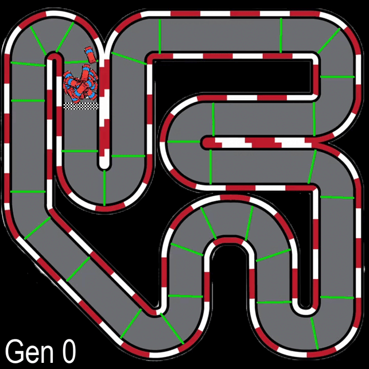
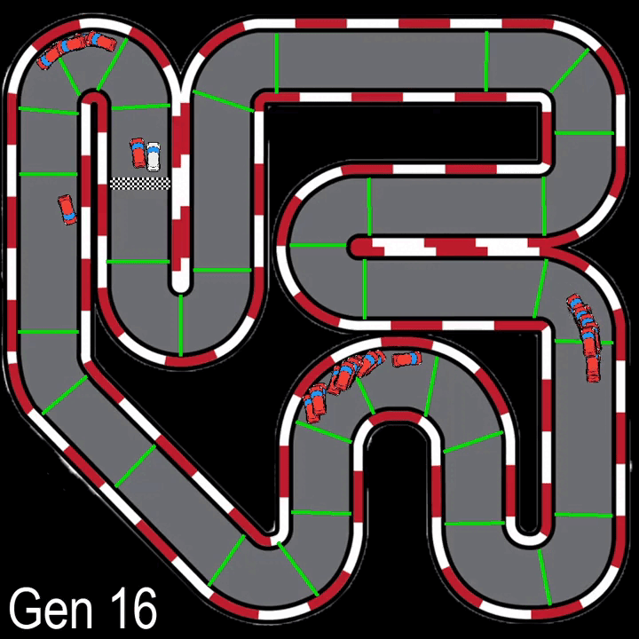
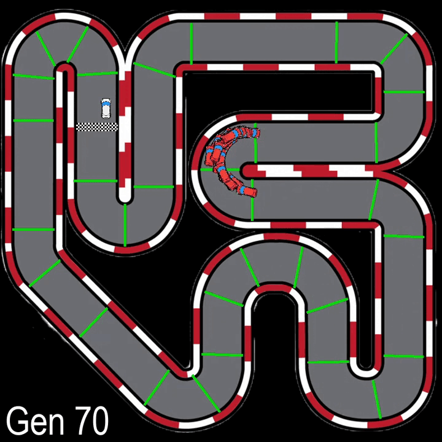
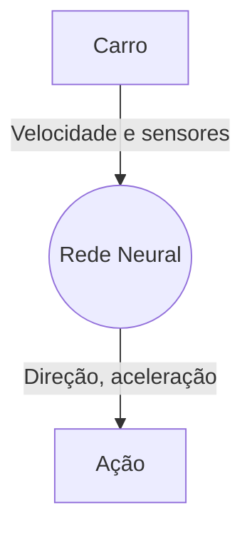
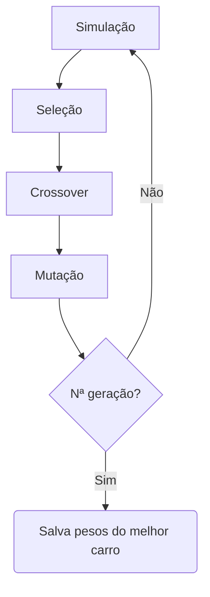
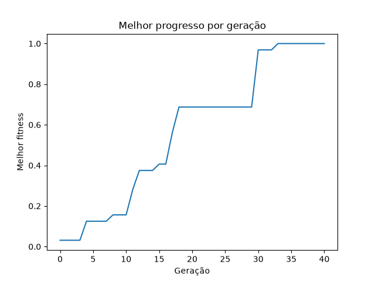
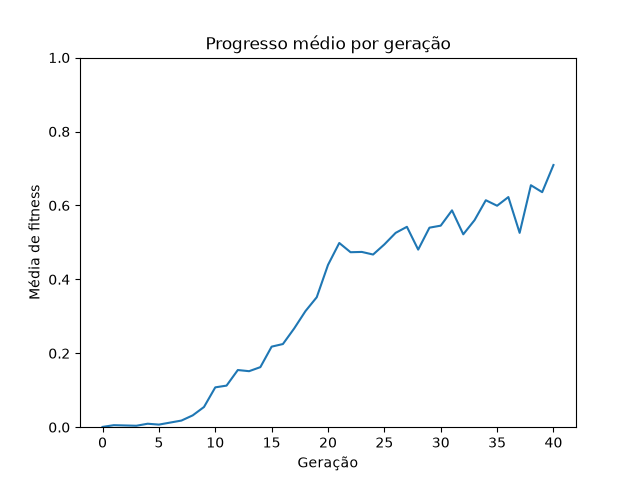

# ANN + GA Car Racing

**Rede Neural Artificial treinada via Algoritmo Genético controla carro em pista de corrida.**

Geração 0 | Geração 16 | Geração 70
:---:|:---: | :---:
 |  | 

Carro autônomo aprende a desviar de obstáculos em uma pista. Treinado por Rede Neural e Algoritmo Genético, ambos desenvolvidos sem o auxílio de bibliotecas de aprendizagem de máquina.

A motivação desse projeto surgiu após eu assistir o vídeo ["Can I make a Better AI Than AI"](https://youtu.be/GGWHjAyKJCA?si=wAQap95mO3w7fEDn) do canal [commonLuke](https://www.youtube.com/@commonLuke). Decidi que queria fazer algo mais completo do que normalmente faço, sem usar bibliotecas de ML, para ter um entendimento mais profundo sobre o funcionamento de uma rede neural. Até então, minha experiência com Machine Learning foi baseada quase que exclusivamente em [Tensorflow](https://www.tensorflow.org/?hl=pt-br).

Bibliotecas centrais usadas:
- Python `3.13.15`
- Pygame `2.6.1`
- NumPy `2.5.2`

Rede Neural:
- Cada carro possui uma rede neural simples: 9 valores de entrada, 6 neurônios da camada oculta com ativação ReLU, e 2 neurônios na camada de saída com ativação tanh. A rede neural retorna dois valores no intervalo [-1, 1], que são usados para controlar a direção e velocidade/freio do carro.

## Como funciona

Lógica do carro



<hr />

Algoritmo Genético


A rede neural recebe 9 valores iniciais: velocidade e a leitura dos 8 sensores de distância. E retorna dois, que controlam a decisão do carro a cada frame:
- Um valor [-1, 1] que representa a direção de rotação. Valores intermediários, como 0.5 ou -0.5, significam uma rotação mais suave.
- Um valor [-1, 1] que representa a quantidade de aceleração. Valores negativos freiam o carro, em vez de acelerar.

Ao fim de cada geração de treinamento, os melhores carros (aqueles que passaram por mais checkpoints) são selecionados pelo Algoritmo Genético para reproduzir ([crossover](https://www.geeksforgeeks.org/machine-learning/crossover-in-genetic-algorithm/)) e gerar descendentes mais aptos. O ciclo continua por N gerações.

## Estrutura do projeto

Os arquivos mais relevantes são:
- `main.py`: define e configura o essencial da biblioteca *pygame* e junta os outros módulos em um projeto funcional.
- `car.py`: define a classe abstrata do carro com seus atributos e métodos, que serve de herança para *PlayerCar* e *ComputerCar*
- `raycaster.py`: módulo responsável pelos sensores de distância que cada carro possui.
- `neural_network.py`: rede neural desenvolvida em NumPy, o centro do projeto.
- `genetic_algorithm.py`: responsável por selecionar, cruzar e mutar os melhores carros de cada época.

## Desafios técnicos

O desenvolvimento do ambiente simulado, feito em pygame, se mostrou a parte que mais tomou tempo. Antes do início do projeto, achei que a rede neural e o algoritmo genético seriam as seções mais desafiadoras. Mas me encontrei voltando incessantemente à implementação do jogo.
Foi uma quebra de expectativa desagradável, pois, enquanto queria aprender mais sobre redes neurais e algoritmos genéticos, essas partes foram as que menos demandaram tempo.

Em relação à implementação da rede neural, não encontrei desafios significativos, apenas pequenas inconveniências. Como, por exemplo, decidir o formato de saída dos valores. De inicio, tinha definido 3 neurônios de saída (aceleração, freio, direção), depois, simplifiquei para 2 saídas (como explicado na seção [Como funciona](#como-funciona))

## Resultados

Como é possível ver nos três GIFs que setão no início do arquivo, a rede neural é capaz de se adaptar bem à pista e, em menos de 15 minutos de treinamento, um resultado satisfatório já é capaz de ser observado.
É importante notar que, às vezes, uma simulação pode iniciar com um bom carro desde a geração 0, enquanto os carros de outras simulações têm dificuldades logo na primeira curva. Isso se deve à inicialização de pesos da rede neural e, dado tempo suficiente, mesmo o pior carro será capaz de completar o percurso.

Abaixo estão alguns gráficos mostrando a evolução do fitness por geração:



## Como executar

1. Clone o repositório no diretório desejado.
```bash
git clone https://github.com/VPivato/ANN-GA-racing-game.git
```

2. Acesse o diretório clonado.
```bash
cd ANN-GA-racing-game
```

3. Crie um ambiente virtual.

### Windows (Powershell)
```powershell
py -m venv .venv
```

### macOS / Linux (Bash)
```bash
python3 -m venv .venv
```

4. Ative o ambiente virtual.
### Windows (Powershell)
```powershell
.venv/scripts/activate.ps1
```

### macOS / Linux (Bash)
```bash
source .venv/bin/activate
```

5. Instale as dependências.
```bash
pip install -r requirements.txt
```

6. Execute `main.py`.
```bash
py main.py
```

## Referências

Algum dos materiais usados ao longo do projeto são:
- ["Can I make a Better AI Than AI"](https://youtu.be/GGWHjAyKJCA?si=wAQap95mO3w7fEDn) do canal [commonLuke](https://www.youtube.com/@commonLuke). Motivação principal do projeto.
- Playlist ["Pygame Car Racing Tutorial"](https://www.youtube.com/playlist?list=PLzMcBGfZo4-kmY7Nh4kI9kPPnxJ5JMRPj) do canal [Tech With Tim](https://www.youtube.com/@TechWithTim). Os dois primeiros vídeos me auxiliaram a criar o ambiente do jogo.
- ["Raycasting Tutorial (in Python)"](https://youtu.be/E18bSJezaUE?si=k-GWR9av9XXVNEwh) do canal [Pythonista_](https://www.youtube.com/@pythonista_333). Me apresentou ao conceito de raycasting, usado para os sensores de distância do carro.
- ["Building a neural network FROM SCRATCH (no Tensorflow/Pytorch, just numpy & math)"](https://youtu.be/w8yWXqWQYmU?si=Zrc4kZJAmwRXX1E0) do canal [Samson Zhang](https://www.youtube.com/@SamsonZhangTheSalmon). O diagrama exibido no vídeo me ajudou a implementar a rede neural.
- ["Forward Propagation in Neural Networks"](https://www.geeksforgeeks.org/deep-learning/forward-propagation-in-neural-networks/). Bom material de apoio.
- ["Weight Initialization | Xavier | He | Zero | Symmetry Problem | Deep Learning Part 7"](https://youtu.be/lyN-OCCrhuo?si=4MUkf4xDFYQEHtzh) do canal [ByteQuest](https://www.youtube.com/@Byte_Quest). Me introduziu ao diferentes tipos de inicialização de pesos.